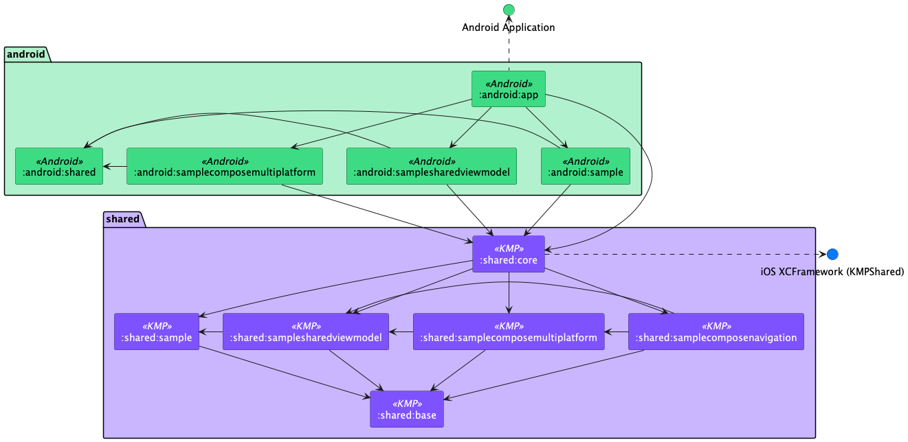

# Matee Starter

## Use Matee Starter as a base for a new project

- Use this repository as a template when creating a new repository for your project
- Run the rename script to rename the project: `./scripts/rename-project.sh` (this handles Android and shared modules)
- Rename iOS project - you can use the prepared script in `ios/scripts/rename.sh`, for more info see
  the [iOS readme](./ios/README.md)

## About

This repo contains our template for multiplatform mobile project. Both Android and iOS
implementations are present with shared modules containing all common business logic organized in Clean
architecture.

**By default, everything up to UI is shared between platforms:**
- **Data layer** (Repositories, Sources)
- **Domain layer** (Use Cases, Domain Models)
- **Presentation layer** (View Models, Compose Multiplatform UI)

**Only navigation is native** - each platform implements its own navigation layer to integrate shared screens into the native navigation structure.

The project contains a **sample feature module** (`samplefeature`) that demonstrates how to structure a complete feature with:
- Infrastructure services (networking)
- Data sources and repositories
- Domain use cases
- Shared view models
- Compose Multiplatform UI
- Native navigation integration

## Architecture

Clean Architecture + MVVM is used for its testability and ease of modularization.
Code is divided into several layers:

- **Data** (`Service`, `Source`, `Repository`) - Data access layer including HTTP services, data sources, and repositories
- **Domain** (`UseCase`, `Model`) - Business logic
- **Presentation** (`ViewModel`, `UI`) - Shared view models and Compose Multiplatform UI

Navigation is handled platform-specifically to integrate shared screens into native navigation structures.



### Shared Modules

#### `:shared:base`
Contains all base classes and common utilities needed across feature modules:
- **Base View Models**: `BaseViewModel`, `BaseScopedViewModel` for shared view models
- **Base Use Cases**: `UseCaseResult`, `UseCaseResultNoParams`, `UseCaseFlowResult` interfaces
- **Base Models**: `Result`, `ErrorResult` for error handling
- Common utilities, error handling, and infrastructure providers

#### `:shared:umbrella`
Combines all feature modules and generates `Framework` for iOS. This is the main module imported in Android modules and provides the Koin initialization.

#### `:shared:samplefeature`
A complete example feature demonstrating:
- **Service**: `JokeService` - Ktor-based networking service (data layer)
- **Data Source**: `JokeSource` interface and `JokeSourceImpl` - abstraction over services
- **Repository**: `JokeRepository` interface and `JokeRepositoryImpl` - domain data access
- **Use Case**: `GetRandomJokeUseCase` - business logic
- **View Model**: `SampleFeatureViewModel` extending `BaseViewModel`
- **UI**: `SampleFeatureMainScreen` - Compose Multiplatform screen

### Android Modules

#### `:android:app`
Main application module providing:
- Application entry point
- Root navigation setup
- Koin initialization

#### `:android:shared`
Shared Android code like common navigation components and utilities.

#### `:android:samplefeature`
Native navigation integration for the sample feature, demonstrating how to integrate shared Compose Multiplatform screens into Android navigation.

### iOS

- More info in the [iOS readme](./ios/README.md)

> **Note:** The whole project relies heavily on dependency injection (Koin for shared/Android, Factory for iOS)

## Creating a new feature

To create a new feature, follow the structure demonstrated in `samplefeature`:

### 1. Create the shared feature module

1. Create a new module in `shared/` (e.g., `shared/myfeature`)
2. Copy `build.gradle.kts` from `shared/samplefeature` and update the `namespace`
3. Add the module to `settings.gradle.kts`:
   ```kotlin
   include(":shared:myfeature")
   ```
4. Add dependency in `shared/umbrella/build.gradle.kts`:
   - **If you don't need to use the module from iOS code**, use `commonMainImplementation`:
     ```kotlin
     commonMainImplementation(project(":shared:myfeature"))
     ```
   - **If you need to use the module from iOS code**, use `commonMainApi` and also add it to `KmmConfig`:
     ```kotlin
     commonMainApi(project(":shared:myfeature"))
     ```
     Then add it to the export list in `build-logic/convention/src/main/kotlin/config/KmmConfig.kt`:
     ```kotlin
     export(project(":shared:myfeature"))
     ```
5. Add the DI module to `shared/umbrella/src/commonMain/kotlin/kmp/shared/umbrella/di/Module.kt`:
   ```kotlin
   modules(
       baseModule,
       // ... other modules
       myFeatureModule,
   )
   ```

### 2. Structure your feature module

Follow the Clean Architecture layers:

```
shared/myfeature/src/commonMain/kotlin/kmp/shared/myfeature/
├── data/
│   ├── model/            # DTOs (Data Transfer Objects)
│   ├── service/          # HTTP services (Ktor clients)
│   ├── source/           # Data source interfaces and implementations
│   └── repository/       # Repository implementations
├── domain/
│   ├── model/            # Domain models
│   ├── repository/       # Repository interfaces
│   └── usecase/          # Use case interfaces and implementations
├── presentation/
│   ├── vm/               # View models (extend BaseViewModel)
│   └── ui/               # Compose Multiplatform screens
└── di/
    └── Module.kt         # Koin module
```

### 3. Create base classes

- **View Models**: Extend `BaseViewModel<S, I, E>` where:
  - `S` is your state (implements `VmState`)
  - `I` is your intent (implements `VmIntent`)
  - `E` is your event (implements `VmEvent`)

- **Use Cases**: Implement one of the following interfaces:
  - `UseCaseResult<Params, T>` or `UseCaseResultNoParams<T>` - for single-shot operations returning `Result<T>`
  - `UseCaseFlow<Params, T>` or `UseCaseFlowNoParams<T>` - for operations returning `Flow<T>`
  - `UseCaseFlowResult<Params, T>` or `UseCaseFlowResultNoParams<T>` - for operations returning `Flow<Result<T>>`

- **Repositories**: Define interface in `domain/repository/`, implement in `data/repository/`

- **Sources**: Define interface in `data/source/`, implement in `data/source/impl/`

### 4. Create Android navigation module

1. Create `android/myfeature` module
2. Copy `build.gradle.kts` from `android/samplefeature`
3. Add to `settings.gradle.kts`:
   ```kotlin
   include(":android:myfeature")
   ```
4. Add dependency in `android/app/build.gradle.kts`:
   ```kotlin
   implementation(project(":android:myfeature"))
   ```
5. Create navigation structure:

   **Create a FeatureGraph** (e.g., `MyFeatureGraph.kt`):
   - Extend `FeatureGraph` and define all screens (destinations) for this feature as `Destination` objects
   - Each `Destination` can define navigation arguments using the `arguments` property
   - For destinations with arguments, create an `Args` class to extract them from `NavBackStackEntry`
   - The graph can have a parent graph for nested navigation
   ```kotlin
   import android.os.Bundle
   import androidx.navigation.NavType
   import androidx.navigation.navArgument
   import kmp.android.shared.navigation.Destination
   import kmp.android.shared.navigation.FeatureGraph
   
   object MyFeatureGraph : FeatureGraph(parent = null) {
       override val path = "myFeature"
       
       data object Main : Destination(this) {
           override val routeDefinition: String = "main"
       }
       
       data object Detail : Destination(this) {
           override val routeDefinition: String = "detail"
           private const val ItemIdArg = "itemId"
           
           override val arguments: List<NamedNavArgument> = listOf(
               navArgument(ItemIdArg) {
                   type = NavType.StringType
               }
           )
           
           internal class Args(
               val itemId: String = "",
           ) {
               constructor(arguments: Bundle?) : this(
                   arguments?.getString(ItemIdArg) ?: "",
               )
           }
       }
   }
   ```

   **Create a NavGraphBuilder extension** (e.g., `MyFeatureNavigation.kt`):
   - This extension function should contain all navigation nodes (routes) for the feature
   - It receives `NavHostController` and creates navigation callbacks to pass down to route extensions
   - Call all route extension functions within the navigation block, passing callbacks as needed
   ```kotlin
   fun NavGraphBuilder.myFeatureNavGraph(
       navHostController: NavHostController,
   ) {
       navigation(
           startDestination = MyFeatureGraph.Main.route,
           route = MyFeatureGraph.rootPath,
       ) {
           myFeatureMainRoute(
               onNavigateToDetail = { itemId ->
                   navHostController.navigate(MyFeatureGraph.Detail(itemId))
               }
           )
           myFeatureDetailRoute(
               onBack = { navHostController.popBackStack() }
           )
           // Add all routes for this feature
       }
   }
   ```
   
   You can also create `NavController` extension functions for navigation:
   ```kotlin
   import androidx.navigation.NavController
   
   internal fun NavController.navigateToMyFeatureDetail(itemId: String = "") {
       navigate(MyFeatureGraph.Detail(itemId))
   }
   ```

   **Create Route composables** (e.g., `MyFeatureMain.kt`):
   - Use the `composableDestination` extension (or `bottomSheetDestination`, `dialogDestination` for other types)
   - The route extension should only receive navigation callbacks as parameters (not `NavHostController` directly)
   - Extract navigation arguments using the `Args` class from the destination
   - The Route composable can accept navigation callbacks as parameters
   - Handle view model state, events, and integrate your shared Compose Multiplatform screen
   ```kotlin
   fun NavGraphBuilder.myFeatureDetailRoute(
       onBack: () -> Unit,
   ) {
       composableDestination(
           destination = MyFeatureGraph.Detail,
       ) { navBackStackEntry ->
           val args = MyFeatureGraph.Detail.Args(navBackStackEntry.arguments)
           
           MyFeatureDetailRoute(
               itemId = args.itemId,
               onBack = onBack,
           )
       }
   }
   
   @Composable
   internal fun MyFeatureDetailRoute(
       itemId: String,
       viewModel: MyFeatureViewModel = koinViewModel(),
       onBack: () -> Unit,
   ) {
       val state by viewModel.state.collectAsStateWithLifecycle()
       
       LaunchedEffect(key1 = viewModel) {
           viewModel.events.collectLatest { event ->
               when (event) {
                   is MyFeatureEvent.NavigateBack -> onBack()
               }
           }
       }
       
       MyFeatureDetailScreen(
           itemId = itemId,
           state = state,
           onIntent = { viewModel.onIntent(it) },
       )
   }
   ```

   **Add the nav graph to root navigation** in `android/app/src/main/kotlin/kmp/android/ui/Root.kt`:
   ```kotlin
   NavHost(navController, startDestination = ...) {
       myFeatureNavGraph(navController)
       // ... other nav graphs
   }
   ```

   The `Destination` class and `NavGraphBuilder` extensions (`composableDestination`, `bottomSheetDestination`, `dialogDestination`) are provided in `android/shared` module and handle route construction with arguments automatically. See the `Destination` and `FeatureGraph` abstract classes for details on how to define navigation arguments.

### 5. Integrate on iOS

Add your feature's shared screen to iOS navigation. See the iOS README for details.

## Tests

### Android

There are UI tests prepared in `android/app/androidTest`. You can take
inspiration and write tests for your own screens with the prepared structure and extensions.

## Android Build Variants

The project uses Android build variants with two dimensions:

1. **Build Type** (debug/release):
   - `debug` - Development builds with debug signing
   - `release` - Release builds with release signing

2. **API Variant** (alpha/production):
   - `alpha` - Connected to alpha/staging data sources (app name prefixed with "[A]")
   - `production` - Connected to production data sources

Available build variants:
- `alphaDebug` - Alpha API with debug build
- `alphaRelease` - Alpha API with release build
- `productionDebug` - Production API with debug build
- `productionRelease` - Production API with release build

Build specific variants:
```bash
# Build alpha debug variant
./gradlew assembleAlphaDebug

# Build production release variant
./gradlew assembleProductionRelease
```

## Convention Plugins

The project uses Gradle convention plugins (located in `build-logic/convention`) to standardize build configuration across modules. These plugins automatically apply common configurations, dependencies, and settings.

### Available Convention Plugins

#### Android Modules
- **`android-application-compose`** - For Android application modules with Compose support
  - Applies Android application plugin, Compose compiler, and Compose dependencies
  - Configures build variants (alpha/production), signing, and Twine string generation
- **`android-application-core`** - For Android application modules without Compose
  - Same as above but without Compose configuration
- **`android-library-compose`** - For Android library modules with Compose support
  - Applies Android library plugin and Compose dependencies
- **`android-library-core`** - For Android library modules without Compose
  - Applies Android library plugin with standard Android configuration

#### Kotlin Multiplatform Modules
- **`kmp-library-core`** - For KMP library modules
  - Configures Kotlin Multiplatform with Android and iOS targets
  - Applies Moko Resources for shared string resources
  - Sets up common dependencies and test configuration
- **`kmp-library-compose`** - For KMP library modules with Compose Multiplatform
  - Extends `kmp-library-core` and adds Compose Multiplatform support
  - Configures Compose compiler and dependencies
- **`kmp-framework-library`** - For KMP modules that generate iOS frameworks
  - Extends `kmp-library-core` and configures iOS framework generation
  - Used by `:shared:umbrella` module to generate the Framework for iOS

### Usage

Simply apply the convention plugin in your module's `build.gradle.kts`:

```kotlin
plugins {
    alias(libs.plugins.mateeStarter.android.application.compose)
    // or
    alias(libs.plugins.mateeStarter.kmp.library.compose)
}
```

The plugin IDs are defined in `gradle/libs.versions.toml` and can be customized after renaming the project.

## Technologies

### DI

#### Android - Koin

Koin supports Kotlin Multiplatform and it's pure Kotlin project. Each module
(including all Android feature modules) has it's own Koin module. All modules (including common
module) are put together inside platform specific code where Koin is initialized.

#### iOS - Factory

We are using DI library Factory.

### Networking - Ktor

Accessing network is usually the most used IO operation for mobile apps so Ktor was used for it's
simple and extensible API and because it's multiplatform capable with different engines for each
platform.

### Resources

#### Twine

All strings in the application are localized and shared with the iOS team
via [Twine](https://github.com/scelis/twine). Strings are stored in the `twine/strings.txt` file.
TwinePlugin then generates appropriate `strings.xml` files from the mentioned `strings.txt` file.
When modifying `strings.txt` it is required to comply with the specified syntax and to pull/push all
the changes frequently

#### Moko

Error messages are shared via [Moko Resources](https://github.com/icerockdev/moko-resources), so
that we can use the strings in the shared code and avoid duplicities when converting errors to
string messages. Error strings are stored in the `twine/errors.txt` file. Gradle task
`generateErrorsTwine` first generates `strings.xml` files from `errors.txt` and then gradle task
`generateMRCommonMain` generates `MR` class that can be used in the common code.

### UI - Compose Multiplatform

We use **Compose Multiplatform** for both Android and iOS. The UI is written once in shared modules and works on both platforms.

For platform-specific UI components that need native implementations, we use `expect`/`actual` declarations:
- Define `expect` declarations in `commonMain` for platform-specific views
- Implement `actual` declarations in platform-specific source sets (`androidMain`/`iosMain`)

On iOS, `expect` views can be implemented via:
- **CInterop** - for C-based native libraries
- **Swift** - using either UIKit or SwiftUI, which are then integrated into Compose via Factory pattern

The Factory pattern allows Swift implementations to be provided to Compose Multiplatform code, enabling seamless integration of native iOS UI components when needed.

### iOS

- More info in the [iOS readme](./ios/README.md)
